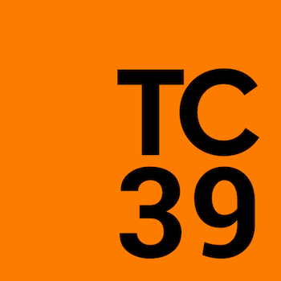
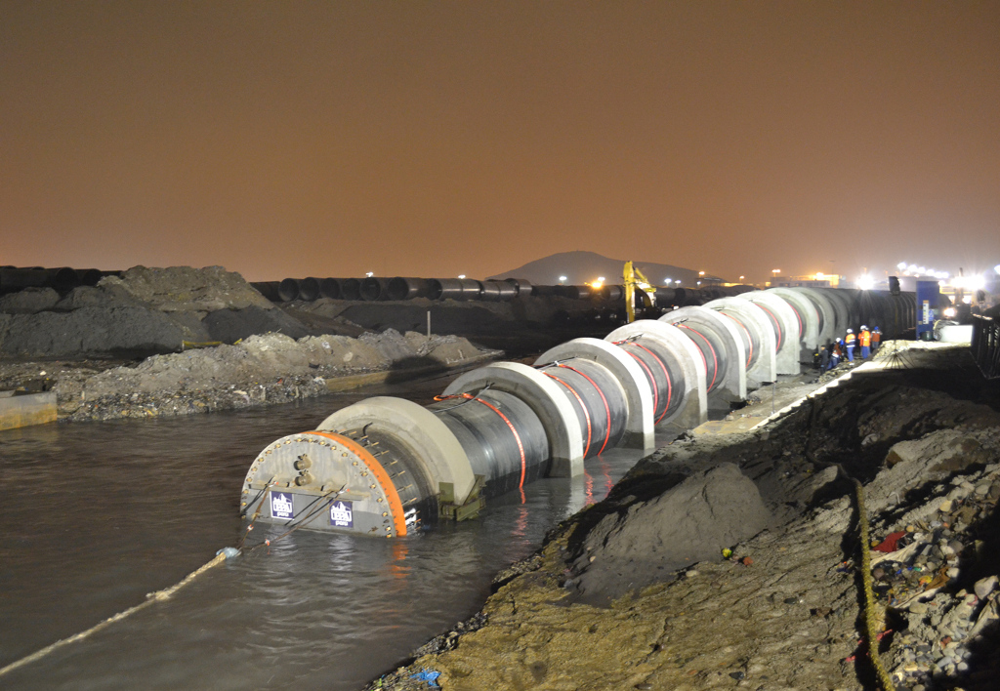
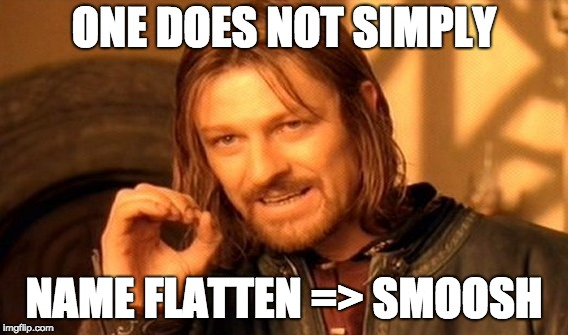

# import * from "future"

---

### `console.log('Hello')`

Lucas Recknagel


[Exellio GmbH](https://www.exellio.de/)

Backend Developer

---

## Todays topics

* ECMA International
* TC39
* Proposals

---

## ECMA International (ecma)

- _European Computer Manufacturers Association_
- Founded in 1961 - Geneva
- Create / Develop:
  - Standards
  - Technical Reports


Note:
European Computer Manufacturers Association => no longer (´94)

---

## ecma Standards

- ECMA-107 – FAT12/FAT16 file system
- ECMA-262 – ECMAScript __<= JS!!!__
- ECMA-404 – JSON
- ECMA-408 – Dart language

---

## ECMA-262

- v1 initial version
- v2 editorial changes
- v3 REGEX 🤯
- v4 abandoned 😭
- v5 JSON, more obj props
- v6 ES6 => ES2015 😍
- v7 `**` && `[].includes`
- v8 async / await, atomics

Note:
ES6 was renamed to ECMAScript 2015
v9 should be out in the next days ...

---



- TC39 => Technical Comitee 39
- _Creators / Curators_ of ECMA-262

Note:
So what is relation ECMA 262 to TC39

---

## TC39 [👉](https://tc39.github.io/beta/)

- consists of:
 - agendas
 - notes
 - proposals,
 - ecma262

Note:
hard to overvieweble collection of git repos

---

## Stages 🚀

- 0 (Strawman) - rough ideas, no criteria
- 1 (Proposal) - solve a existing issue
- 2 (Draft) - initial spec
- 3 (Candidate) - feedback, implementations
- 4 (Finished) - ready for inclusion

Note:
rocket for championing, min 18 month

---

# Proposals

---


---

# Proposals
### Stage 1

---

## The Pipeline Operator



Note:
its not like that ...

---

## The Pipeline Operator `|>`

* function composition sugar 🍭
* consists of:
  * [👉](https://github.com/tc39/proposal-pipeline-operator) simple proposal
  * [👉](https://github.com/js-choi/proposal-smart-pipelines) smart proposal
  * [👉](https://github.com/valtech-nyc/proposal-fsharp-pipelines/blob/master/README.md) f# proposal

Note:
Firefox implements it, compile flag
simple: Stage-1, basics
smart: Stage-0, await, statement blocks, pipeline fns
f#: like simple

---?code=src/pipeline_01.js&lang=js&title=Pipeline

@[1-3](basic fns)
@[5-9](current usage)
@[10-18](pipe it!)

Note:
How many of you heard of it

---?code=src/pipeline_02.js&lang=js&title=Pipeline

@[1-4](basic obj + fns)
@[6](current usage)
@[8-14](pipe it!)

---

## Partial application

* assign partial amount of arguments
* mainly returning a function again
* subject of change [👉](https://github.com/tc39/proposal-partial-application/pull/22)
* [👉](https://github.com/tc39/proposal-partial-application) `...` details

---

## Partial application

```js
f(x, ?)           // from left
f(x, ...)         // from left with rest
f(?, x)           // from right
f(..., x)         // from right with rest
f(?, x, ?)        // for any arg
f(..., x, ...)    // for any arg with rest
```

---?code=src/partial_01.js&lang=js&title=PartialApplication

---?code=src/partial_02.js&lang=js&title=PartialApplication

---

## Pattern matching

* `switch / case` with destructuring
* works like _Rust´s / Scalas_ match
* [👉](https://github.com/tc39/proposal-pattern-matching) `...` details

---?code=src/match.js&lang=js&title=PatternMatching

---

## Optional Chaining `?.`

* deep property extraction sugar 🍭
* [👉](https://github.com/tc39/proposal-optional-chaining) `...` details

---?code=src/ochain_01.js&lang=js&title=OptionalChaining

@[1-4](simple map)
@[6-7](current usage)
@[9-12](simple extraction)

---?code=src/ochain_02.js&lang=js&title=OptionalChaining

---?code=src/ochain_03.js&lang=js&title=OptionalChaining

@[8-9](result)
@[11-16](stacking)

---

# Proposals
### Stage 2

---

## `throw` expressions

* exceptions from expression context
* [👉](https://github.com/tc39/proposal-throw-expressions) `...` details

---?code=src/throw.js&lang=js&title=throw expressions

@[1-3](default parameter)
@[5-7](conditional)

---

## `@decorators`

* 🍭 Sugar for concepts like:
  * Higher order functions
  * functional composition
* `decorating` one object with functionality of another
* [👉](https://github.com/tc39/proposal-decorators) `...` details

---?code=src/decorators_01.js&lang=js&title=Decorators

@[4-5](readonly)
@[7-10](logging)

---?code=src/decorators_02.js&lang=js&title=Decorators

---?code=src/decorators_03.js&lang=js&title=Decorators

---?code=src/decorators_04.js&lang=js&title=Decorators

---

# Proposals
### Stage 3

---



---

## `[].flat(), [].flatMap()`

* reducing sugar 🍭
* [👉](https://github.com/tc39/proposal-flatMap) `...` details

---?code=src/flat.js&lang=js&title=ArrayFlat

@[1-3](flat)
@[4-6](flatMap)

---


---

# [👉](https://github.com/tc39/proposals) all proposals

---

# Future of the future

---

## Its up to you!


---

# Enough Future - back to the now

---?image=assets/image/hire.png

Note:
no legacy, no cross browser
newest stack, mostly free choosable working time

---

### Thanks for listening

---

## Maybe useful links

* [TC39](https://tc39.github.io/beta/)
* [KANGAX](http://kangax.github.io/compat-table/esnext/)
* [node.green](node.green)
* [DecoratorsDeep](https://www.sitepoint.com/javascript-decorators-what-they-are/)

---

## Main Sources

* [The web](https://google.com)
* [ECMA](https://www.ecma-international.org/)
* [TC39](https://github.com/tc39)
* [Pipeline Image](https://www.plastics.gl/construction/mega-wastewater-treatment-plant/)
* [Memes](https://google.com/...)
* [Proposal Pages](https://github.com/tc39/proposals)

---