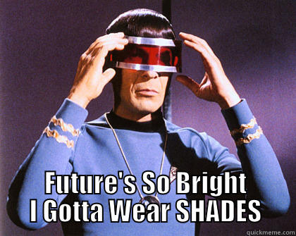

# import * from "future“;

---

## Hello

Lucas Recknagel

[Exellio GmbH](https://www.exellio.de/)

Backend Developer

---

## Todays topics

* ECMA International?!
* TC39 Overview
* Proposals
* Future of the future

---

## ECMA International (ecma)

- _European Computer Manufacturers Association_
- Founded in 1961 - Geneva
- Create / Develop:
  - Standards
  - Technical Reports

Note:
European Computer Manufacturers Association => no longer (´94)

---

## ecma Standards

- ECMA-107 – FAT12/FAT16 file system
- ECMA-262 – ECMAScript __<= JS!!!__
- ECMA-404 – JSON
- ECMA-408 – Dart language

---

## ECMA-262

### TODO SPLIT IN separate foils with images for version features

- v1 initial version
- v2 editorial changes
- v3 REGEX 🤯
- v4 abandoned 😭
- v5 JSON, more obj props
- v6 ES6 => ES2015 😍
- v7 `**` && `[].includes`
- v8 async / await, atomics

Note:
ES6 was renamed to ECMAScript 2015
v9 should be out in the next days ...

---

- TC39 => Technical Comitee 39
- _Creators / Curators_ of ECMA-262

Note:
So what is relation ECMA 262 to TC39

---

## TC39 (https://tc39.github.io/beta/)

- consists of:
 - agendas
 - notes
 - proposals,
 - ecma262

Note:
hard to overvieweble collection of git repos

---

## Stages 🚀

- 0 (Strawman) - rough ideas, no criteria
- 1 (Proposal) - solve a existing issue
- 2 (Draft) - initial spec
- 3 (Candidate) - feedback, implementations
- 4 (Finished) - ready for inclusion

Note:
rocket for championing, min 18 month

---

# Proposals

---

---

## The Pipeline Operator `|>`

Stage 1
syntax sugar for function composition
works with await
simple: https://github.com/tc39/proposal-pipeline-operator
smart: https://github.com/js-choi/proposal-smart-pipelines
f#: https://github.com/valtech-nyc/proposal-fsharp-pipelines/blob/master/README.md

---

## The Pipeline Operator `|>`

---?code=src/pipeline_01.js&lang=js&title=Pipeline

@[1-3](TODO)

Note:
How many of you heard of it

---?code=src/pipeline_02.js&lang=js&title=Pipeline

@[1-3](TODO)

---

## https://github.com/tc39/proposal-partial-application

Note:
Stage 1;

---

## https://github.com/tc39/proposal-pattern-matching

Note:
Stage 1;

---

## https://github.com/tc39/proposal-collection-methods

Note:
Stage 1;

---

## https://github.com/tc39/proposal-observable

Note:
Stage 1;

---

## https://github.com/tc39/proposal-throw-expressions

Note:
Stage 2;

---

## https://github.com/tc39/proposal-decorators

Note:
Stage 2;

---

=> smoosh and smooshMap meme

## https://github.com/tc39/proposal-flatMap

Note:
Stage 3;

---

## https://github.com/tc39/proposal-private-methods

Note:
Stage 3;

---

# Future of the future

---

## Its up to you!

---

# Enough Future - back to the now
### Thanks for listening

---

## Maybe useful links

* [TC39](https://tc39.github.io/beta/)
*

---

## Main Sources

* [The web](https://google.com)
* [ECMA](https://www.ecma-international.org/)
* [TC30](https://github.com/tc39)
* [Pipeline Image](https://www.plastics.gl/construction/mega-wastewater-treatment-plant/)
* [Pipeline Operator](https://github.com/tc39/proposal-pipeline-operator)

---